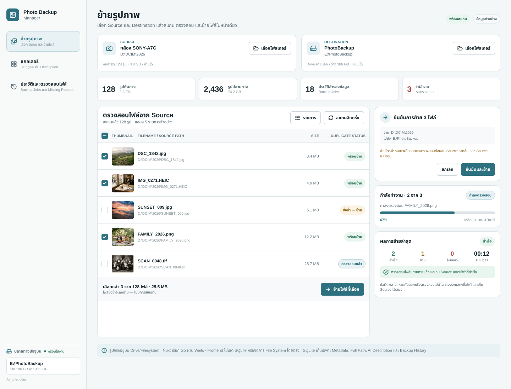
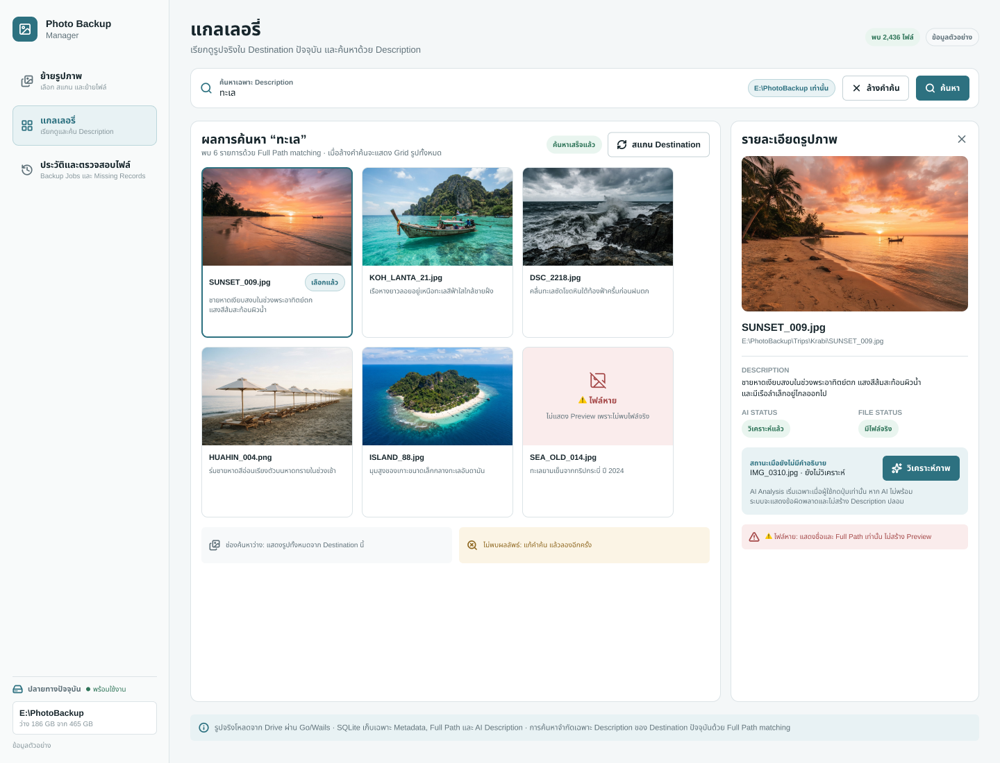
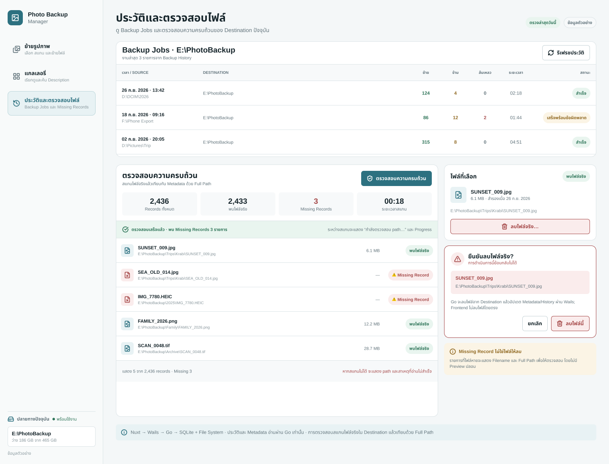

# UI Design — Photo Backup Manager

> ใช้โปรแกรม FinalPhotoMover ที่แนบมาเป็นตัวอย่างด้าน Layout/Workflow แล้วเพิ่มเฉพาะ Gallery, AI Description และ Description Search ที่โจทย์ Final ต้องการ

## ภาพตัวอย่าง UX/UI

ภาพตัวอย่างด้านล่างแยกตามหน้าหลักทั้ง 3 หน้า ใช้ประกอบการอ้างอิง Layout และ Workflow โดยข้อมูลในภาพเป็นข้อมูลตัวอย่าง

### Move Photos

### Gallery

### History & Check

## โครงหน้า

ใช้ Sidebar และ Main Content แบบโปรแกรมอ้างอิง มี 3 เมนู:

- **Move Photos** — เลือกโฟลเดอร์ ดูรายการรูป เลือกและย้ายไฟล์
- **Gallery** — ดู/ค้นรูปในปลายทางและคำอธิบายภาพ
- **History & Check** — ดูประวัติ ตรวจไฟล์หาย และลบไฟล์หลังยืนยัน

ไม่แยก Dashboard เป็นหน้าเพิ่ม ให้แสดงจำนวนรูปต้นทาง/ปลายทางและงานล่าสุดแบบย่อในหน้า Move Photos ไม่มี Settings, Tag หรือ Category

## Move Photos

คงรูปแบบหลักของ FinalPhotoMover:

1. เลือก Source และ Destination ผ่าน Folder Picker พร้อมแสดงพาธ
2. แสดงจำนวนรูปและรายการภาพจริงจาก Source พร้อมตัวเลือกเลือกบางรูป/ทั้งหมด
3. ให้ย้ายไฟล์ที่เลือกหรือย้ายทั้งหมด
4. ก่อนย้าย แสดงกล่องยืนยันที่มีจำนวนไฟล์และพาธต้นทาง/ปลายทาง
5. ระหว่างย้าย แสดง Progress และผลรายไฟล์
6. เมื่อเสร็จ สรุปจำนวนสำเร็จ/ข้าม/ล้มเหลวและเวลาจริง

ไม่เขียนทับชื่อซ้ำ; การย้ายข้ามไดรฟ์ต้องตรวจไฟล์ปลายทางก่อนลบ Source; ถ้าย้ายไม่สำเร็จ Source ต้องอยู่

## Gallery และ Image Detail

แสดงภาพจริงจาก Destination เป็น Grid เรียบง่าย มีช่องค้น Description อยู่ด้านบนและค้นเฉพาะ Metadata ของ Destination นี้ เมื่อเลือกภาพให้เปิดแผงรายละเอียดที่มีภาพจริง, Filename, Full Path, Description และสถานะ

รูปที่ยังไม่มี Description มีปุ่ม Analyze ให้ผู้ใช้กดเอง เมื่อไฟล์หายให้แจ้ง Missing และไม่แสดง Preview เสมือนว่าไฟล์ยังอยู่

## History & Check

แสดง Backup Jobs ของ Destination ที่เลือกแบบย่อ: เวลา, จำนวนที่ย้าย/ข้าม/ล้มเหลว และ Duration ใช้การสแกนปลายทางเพื่อแสดงไฟล์จริงและ Missing Records; การลบไฟล์จริงต้องยืนยันชื่อและพาธก่อน

## รูปแบบและขอบเขตข้อมูล

- ธีม Minimal แบบ Desktop: พื้นหลังสว่าง, พื้นผิวเรียบ, เส้นแบ่งบาง, สีเน้นสีเดียว, ไอคอนเรียบง่าย และตัวอักษรอ่านง่าย
- ออกแบบหน้าหลักและสถานะจำเป็นในหน้าเดิม ไม่ทำหน้าแยกทุกสถานะ
- ใช้สีร่วมกับป้ายข้อความ อย่าสื่อสถานะด้วยสีอย่างเดียว
- ภาพจริงอยู่ใน Drive/Filesystem; SQLite เก็บ Metadata, Full Path, Description และประวัติเท่านั้น
- Nuxt เรียก Go ผ่าน Wails; Frontend ห้ามเปิด SQLite หรือจัดการ File System โดยตรง
- ไม่มี Tag/Tag Cloud/Category/Hash Identity/Changed Detection/Cloud Sync/Phone Import เฉพาะทางในรุ่นส่งงาน
