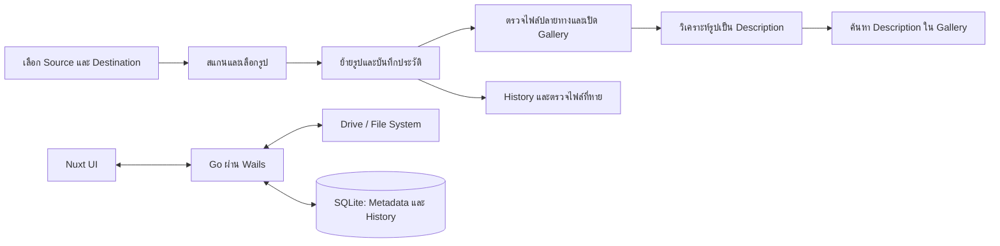

# คู่มือเอกสารโครงการ

หน้านี้เป็นจุดเริ่มต้นสำหรับทีม ไม่จำเป็นต้องอ่านเอกสารทุกไฟล์ ให้เริ่มจากภาพรวม แล้วเลือกอ่านตามงานที่รับผิดชอบ

## โครงการนี้คืออะไร

**Photo Backup Manager** เป็นแอป Desktop สำหรับเลือกโฟลเดอร์รูปต้นทาง ตรวจรายการ แล้วเลือกย้ายรูปไปยังปลายทาง พร้อมประวัติและการตรวจไฟล์ที่หาย ส่วนที่เพิ่มสำหรับ Final คือวิเคราะห์รูปที่ผู้ใช้เลือกเป็น **Description** ด้วย AI และค้นหารูปจาก Description ใน Gallery

ไฟล์รูปจริงอยู่ใน Drive/ระบบไฟล์ ส่วนฐานข้อมูล SQLite เก็บ Metadata, Path, Description และประวัติเท่านั้น ปัจจุบัน Repository ยังเป็น Wails/Nuxt scaffold; เอกสารระบุข้อกำหนดและแผน ไม่ใช่รายการฟีเจอร์ที่ทำเสร็จแล้ว

## ภาพรวมการทำงาน

## เริ่มอ่านตรงไหนดี

1. อ่าน [00 — Project Blueprint](00-PROJECT-BLUEPRINT.md) เพื่อเข้าใจเป้าหมาย ขอบเขต และสถานะจริงของ Repository
2. เปิดเอกสารเฉพาะส่วนที่ตัวเองรับผิดชอบจากรายการด้านล่าง
3. ใช้ [Setup Guide](SETUP_GUIDE.md) เมื่อต้องติดตั้งหรือรันโปรเจกต์

## เลือกอ่านตามหน้าที่

| หน้าที่ | อ่านก่อน | อ่านเพิ่มเมื่อจำเป็น |
| --- | --- | --- |
| ทุกคนในทีม | [Project Blueprint](00-PROJECT-BLUEPRINT.md), [Flow Spec](04-FLOW-SPEC.md) | [ข้อกำหนดและแผนพัฒนา](ข้อกำหนดและแผนลงมือพัฒนา%20Final%20Project%20Photo%20Backup.md) |
| Backend | [API Contract](01-API-CONTRACT.md), [Member: Backend](members/01-BACKEND.md) | [Flow Spec](04-FLOW-SPEC.md), [Database Spec](02-DATABASE-SPEC.md) |
| Database | [Database Spec](02-DATABASE-SPEC.md), [Member: Database](members/02-DATABASE.md) | [API Contract](01-API-CONTRACT.md) |
| Frontend | [UI Spec](03-UI-SPEC.md), [UI Design](05-UI-DESIGN.md), [Member: Frontend](members/03-FRONTEND.md) | [API Contract](01-API-CONTRACT.md), [Stitch UI Prompt](STITCH_UI_PROMPT.md) |
| AI / Testing | [Flow Spec](04-FLOW-SPEC.md), [AI & Testing](members/04-AI-TESTING.md) | [API Contract](01-API-CONTRACT.md), [Test Data](test-data/README.md) |

## แผนที่เอกสาร

- [00 — Project Blueprint](00-PROJECT-BLUEPRINT.md): ภาพรวม ขอบเขต และสถานะปัจจุบัน
- [01 — API Contract](01-API-CONTRACT.md): เมธอดที่ UI เรียกใช้ รูปแบบข้อมูล และข้อผิดพลาด
- [02 — Database Spec](02-DATABASE-SPEC.md): ตารางและความสัมพันธ์ของข้อมูล
- [03 — UI Spec](03-UI-SPEC.md): หน้าจอ องค์ประกอบ และสถานะที่ต้องรองรับ
- [04 — Flow Spec](04-FLOW-SPEC.md): ลำดับการย้าย ตรวจสอบ วิเคราะห์ และค้นหา
- [05 — UI Design](05-UI-DESIGN.md): แนวทาง Layout และภาพตัวอย่าง UX/UI
- [Member Docs](members/01-BACKEND.md): รายละเอียดแบ่งงานตามสมาชิก
- [Test Data](test-data/README.md): ข้อมูลตัวอย่างสำหรับทดสอบ
- [Stitch UI Prompt](STITCH_UI_PROMPT.md): Prompt สำหรับสร้างแนวทางหน้าจอ
- [Setup Guide](SETUP_GUIDE.md): ติดตั้งและเริ่มรันโปรเจกต์

เอกสารแผนฉบับเต็ม: [ข้อกำหนดและแผนลงมือพัฒนา](ข้อกำหนดและแผนลงมือพัฒนา%20Final%20Project%20Photo%20Backup.md) และ [แผนโครงงาน Final Project](แผนโครงงาน%20Final%20Project%20โปรแกรมสำรองรูปภาพจาก%20Flash%20Drive%20หรือโทรศัพท์มือถือ.md)
