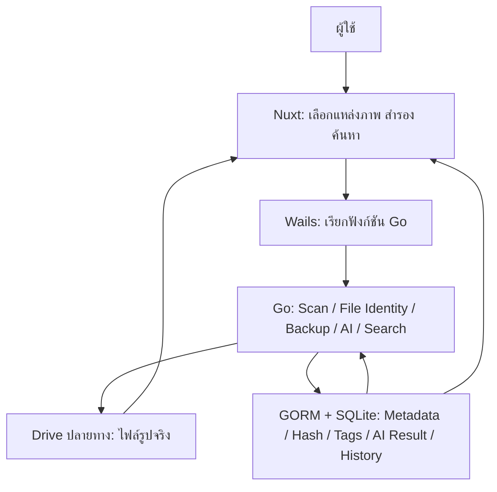

# แผนโครงงาน Final Project: โปรแกรมสำรองรูปภาพจาก Flash Drive หรือโทรศัพท์มือถือ

> เอกสารฉบับนี้ใช้ทำความเข้าใจโจทย์ วางขอบเขต แบ่งงาน และตรวจความพร้อมก่อนสาธิต  
> ที่มา: ภาพประกาศ Final Project ที่ผู้ใช้แนบมา  
> สถานะ: แผนเริ่มต้น — รายละเอียดที่โจทย์อ้างถึงข้อสอบกลางภาคและเกณฑ์ที่อาจารย์ยังไม่ได้ระบุ ต้องตรวจยืนยัน

> **ข้อกำหนด Architecture ที่ปรับปรุง:** รูปจริงต้องอยู่บน Drive/Storage ปลายทางเท่านั้น SQLite/GORM เก็บเฉพาะ Metadata ที่จับคู่ด้วย Full Path ในเวอร์ชันแรก, AI Description และ Backup History ห้ามเก็บรูปเป็น Binary/Base64/BLOB หรือ Thumbnail Binary รายละเอียดที่กล่าวถึงการ “บันทึกข้อมูลรูป” ในส่วนถัดไปหมายถึง Metadata เท่านั้น ดู Specs ล่าสุดใน `docs/` เป็น Contract ปัจจุบัน

> **ขอบเขตส่งงานที่ทีมเลือก:** วิเคราะห์และค้นด้วย Description เท่านั้น; ไม่ทำ Tag/Tag Cloud/Category, Hash Identity, Changed/Renamed Detection, Re-analysis Cache หรือ Metadata Portability ในรุ่นส่งงาน ใช้ Full Path จับคู่ Metadata ชั่วคราว รายการทางเลือกในเอกสารนี้มีไว้เพื่ออธิบายโจทย์เท่านั้น ไม่ใช่งานที่ต้องพัฒนา

> **การอ่านเอกสาร:** ข้อกำหนดที่เป็นทางเลือกในภาพโจทย์และตัวอย่างด้านล่างไม่ใช่รายการงานทั้งหมดที่ต้องทำ ให้ยึด Blueprint และ API/Database/UI/Flow Specs ใน `docs/` เป็นสัญญาขอบเขตปัจจุบัน

## 1. โครงงานนี้ต้องทำอะไร

พัฒนา **โปรแกรมเดสก์ท็อปสำหรับสำรองรูปภาพ** จาก Flash Drive หรือโทรศัพท์มือถือไปยังโฟลเดอร์ปลายทาง ผู้ใช้เลือกแหล่งภาพและปลายทาง เริ่มสำรองข้อมูล ดูผลการทำงาน วิเคราะห์ภาพเพื่อเก็บคำอธิบายหรือแท็ก แล้วค้นหารูปภาพจากข้อมูลนั้นได้ โดยแสดงผลการค้นหาเป็นรูปภาพหลายรูป

เทคโนโลยีตามโจทย์:

- **Wails**: โครงแอปเดสก์ท็อปและตัวเชื่อมหน้าจอกับ Go
- **Nuxt**: ส่วนติดต่อผู้ใช้ (Frontend)
- **Go**: ตรรกะการสำรองไฟล์ การสแกนรูป และการจัดการข้อมูล
- **SQLite + GORM**: ฐานข้อมูลในเครื่องและการเข้าถึงฐานข้อมูลจาก Go
- **Windows และ macOS**: ระบบที่ต้องใช้งานได้จริง

**ภาพรวมการทำงาน:** ผู้ใช้เลือกต้นทาง/ปลายทาง → สแกนและย้ายไฟล์ตามเกณฑ์กลางภาค → บันทึก Metadata และ Backup History ใน SQLite → สั่งวิเคราะห์ภาพเพื่อบันทึก Description → ค้น Description และเปิดภาพจริงจาก Drive

## 2. ข้อกำหนดที่ระบุชัดในโจทย์

| รหัส | ข้อกำหนด | หลักฐานที่ควรสาธิต |
| --- | --- | --- |
| R1 | ใช้ Wails และสร้าง Frontend ด้วย Nuxt | เปิดโปรแกรมเดสก์ท็อปและใช้งานหน้าจอ Nuxt |
| R2 | ใช้ SQLite เป็นฐานข้อมูล และ GORM เชื่อมต่อ | เปิดข้อมูลรูปและรายละเอียดที่บันทึกไว้หลังปิด/เปิดโปรแกรมใหม่ |
| R3 | ความสามารถการ Backup เทียบเท่าข้อสอบกลางภาค | สาธิตทุกพฤติกรรมที่ระบุในข้อสอบกลางภาคจริง พร้อมผลสำเร็จ/ผิดพลาด |
| R4 | วิเคราะห์รายละเอียดภาพได้อย่างน้อยหนึ่งแบบ: **คำอธิบายภาพ** หรือ **Tag** (ทำทั้งคู่ได้) | แสดงผลที่ได้กับภาพตัวอย่างและตรวจดูข้อมูลที่เก็บ |
| R5 | ค้นหาและแสดงผล **หลายรูป** จากคำอธิบายภาพหรือ Tag (เลือกอย่างน้อยหนึ่งแบบ หรือทำทั้งคู่) | ค้นด้วยคำเดียวแล้วได้ภาพที่เกี่ยวข้องหลายรูป |
| R5.1 | ถ้าเลือกค้นจาก Tag ต้องแสดง **Tag Cloud** ด้วย | แสดงคำแท็กและกด/เลือกแท็กเพื่อดูผลค้นหา |
| R5.2 | ถ้าเลือกค้นจากคำอธิบายภาพ ต้องมี **ช่องค้นหาแบบพิมพ์เอง** และแก้ไขข้อความค้นหาได้ | พิมพ์ แก้ไข และค้นใหม่ด้วยข้อความอื่น |
| R6 | สมาชิกกลุ่มไม่เกิน 4 คน; จำนวนกลุ่มทั้งชั้นไม่เกิน 15 กลุ่ม | ตรวจรายชื่อและการลงทะเบียนกลุ่มตามช่องทางของอาจารย์ |
| R7 | ทำงานได้บน Windows และ macOS | Build/รันและสาธิตหรือเตรียมหลักฐานทดสอบบนทั้งสองระบบ |
| R8 | Progress Demo 1 ครั้งก่อนสอบ Final: อธิบายความคืบหน้าและเทคนิค ภายใน 15 นาที | โครงสร้างโปรเจกต์ งานที่ทำแล้ว และเดโม่ปัจจุบัน |
| R9 | Technical Demo 1 ครั้งช่วงสอบ Final: อธิบายเทคนิคและแต่ละ Feature ที่ทำได้ | เดโม่ Feature จากต้นทางจนค้นหารูป และอธิบายโค้ด/ข้อมูล |
| R10 | เวลาสาธิตรวมต่อกลุ่มไม่เกิน **5 ชม. ÷ จำนวนกลุ่มทั้งหมด** | ซ้อมเวลาจากจำนวนกลุ่มจริงและเตรียมเวอร์ชันย่อ |

> เกณฑ์ให้คะแนนสุดท้ายขึ้นกับอาจารย์ผู้สอนตามข้อความในภาพ จึงไม่ควรสมมติคะแนนราย Feature เอง

## 3. ขอบเขตการสำรองข้อมูลที่ต้องตรวจจากข้อสอบกลางภาค

โจทย์ Final ระบุเพียงว่า Backup ต้องมีความสามารถ “เทียบเท่ากับข้อสอบกลางภาค” จึงต้องนำใบงาน/เกณฑ์กลางภาคฉบับจริงมาตรวจเทียบก่อนล็อกขอบเขต หากเป็นงาน Flash Drive Backup CLI ที่เคยทำ ฟังก์ชันที่ควรตรวจเป็นพิเศษ ได้แก่ การเลือก/บันทึกต้นทางและปลายทาง การย้ายไฟล์ทั้งหมดหรือเฉพาะไฟล์ที่เลือก การแสดงรายการไฟล์ที่ต้นทาง/ปลายทาง/ฐานข้อมูล และการตรวจไฟล์ที่มีประวัติในฐานข้อมูลแต่หายจากปลายทาง

**ข้อเท็จจริงจากโจทย์กลางภาคที่ได้รับเพิ่ม:** คำสั่ง `/move` ต้องย้ายไฟล์จริง ลบต้นทางหลังย้ายสำเร็จ และหากย้ายข้ามไดรฟ์ต้องคัดลอกจนเสร็จก่อนลบต้นทาง; ตรวจไฟล์ชื่อซ้ำจากทั้งปลายทางและฐานข้อมูล; แสดงเวลา; เก็บประวัติแยกตาม Destination; ตรวจไฟล์ที่มีใน DB แต่หายจากโฟลเดอร์; รองรับการลบไฟล์และอัปเดต DB. **ยังต้องยืนยัน** ว่า Final ต้องรักษาพฤติกรรมการย้ายและการลบต้นทางตามตัวอักษรหรืออาจารย์อนุญาตให้ใช้การคัดลอกแบบ Backup; รวมทั้งขอบเขตชนิดไฟล์สำหรับ Final

### ขั้นต่ำที่ควรทำให้ครบในหน้าจอ

- เลือกไดรฟ์/โฟลเดอร์ต้นทางและโฟลเดอร์ปลายทาง; แสดงพาธที่เลือก
- ตรวจว่าแหล่งข้อมูลเข้าถึงได้ พื้นที่ปลายทางพอสมควร และไม่เลือกปลายทางซ้อนอยู่ในต้นทาง
- สแกนจำนวนภาพและแสดงรายการก่อนเริ่มงาน
- เริ่มสำรองหลายไฟล์ แสดงความคืบหน้า จำนวนสำเร็จ/ล้มเหลว และสรุปผล
- ไม่เขียนทับไฟล์คนละรูปโดยเงียบ ๆ; กำหนดนโยบายชื่อซ้ำ/ไฟล์ซ้ำ
- เก็บประวัติไฟล์ใน SQLite และเปิดดูรูปจากตำแหน่งที่สำรองไว้
- เปิดโปรแกรมใหม่แล้วข้อมูลและรายการรูปยังอยู่
- หากข้อสอบกลางภาคกำหนดการตรวจความครบถ้วนหรือรายการต้นทาง/ปลายทาง/DB ให้มีหน้าจอหรือรายงานรองรับด้วย

## 4. เส้นทางผู้ใช้ที่โปรแกรมควรรองรับ

1. **เริ่มต้น:** เปิดแอป เลือกต้นทางจาก Flash Drive หรือพื้นที่รูปภาพของโทรศัพท์ที่ระบบเข้าถึงได้ แล้วเลือกปลายทาง
2. **เตรียมสำรอง:** แอปสแกนไฟล์รูปที่รองรับ แสดงจำนวนและข้อผิดพลาดเบื้องต้น
3. **สำรอง:** ผู้ใช้กดเริ่ม แอปย้ายไฟล์ตามเกณฑ์กลางภาค แสดงสถานะ และบันทึกเฉพาะรายการที่สำเร็จอย่างถูกต้อง
4. **จัดรายละเอียด:** แอปวิเคราะห์ภาพเป็นคำอธิบายหรือแท็ก ผู้ใช้เห็นผลและแก้ไขข้อมูลได้ถ้าเลือกทำความสามารถนี้
5. **ค้นหา:** ผู้ใช้พิมพ์หรือแก้คำค้น Description; เห็นภาพจริงที่ตรงกันหลายรูปและเปิดดูรายละเอียดได้
6. **กลับมาใช้อีกครั้ง:** เปิดแอปใหม่ เห็นประวัติและค้นหาภาพที่ยังอยู่ในปลายทางได้

### ข้อจำกัดของโทรศัพท์ที่ต้องระบุให้ชัด

Wails เป็นแอปเดสก์ท็อป การอ่านรูปจากโทรศัพท์ขึ้นกับวิธีที่ Windows/macOS มองเห็นอุปกรณ์และสิทธิ์เข้าถึงไฟล์ การเลือกโฟลเดอร์ผ่านระบบอาจใช้กับบางเครื่องได้ แต่โทรศัพท์ที่ต่อแบบ MTP หรือ iPhone อาจไม่แสดงเป็นพาธไฟล์ปกติ **อย่ารับปากว่ารองรับทุกเครื่อง** ก่อนพิสูจน์บนอุปกรณ์จริง ทางเลือกที่ควบคุมได้คือให้ผู้ใช้ส่งออกรูปไปยังโฟลเดอร์ในคอมพิวเตอร์ก่อน แล้วเลือกโฟลเดอร์นั้นเป็นต้นทาง หากอาจารย์กำหนดให้เสียบโทรศัพท์แล้วสำรองโดยตรง ต้องออกแบบและทดสอบขั้นตอนนำเข้าบน Windows/macOS แยกกัน

## 5. การออกแบบระบบที่แนะนำ



### หน้าที่ของแต่ละส่วน

| ส่วน | หน้าที่ |
| --- | --- |
| Nuxt | หน้าเลือกต้นทาง/ปลายทาง รายการรูป ความคืบหน้า ฟอร์มคำอธิบาย Tag Cloud และผลค้นหา |
| Wails | ส่งคำสั่งจากหน้าจอให้ Go และส่งเหตุการณ์ความคืบหน้ากลับไปแสดง |
| Go | ตรวจพาธ สแกนชนิดไฟล์ ย้ายพร้อม fallback คัดลอกแล้วลบตามเกณฑ์กลางภาค ตรวจความถูกต้อง จัดการข้อผิดพลาด และค้นหา |
| SQLite/GORM | เก็บเฉพาะ File ID/Path/Hash/Size/Type/เวลา, AI Metadata, Tags, Status และ Backup History; ห้ามเก็บ Image Binary/Base64/BLOB/Thumbnail Binary |
| โฟลเดอร์ปลายทาง | เก็บ **ไฟล์รูปจริง**; SQLite ห้ามเก็บ Image Binary, Base64, BLOB หรือ Thumbnail Binary |

**การประกอบ Nuxt กับ Wails:** ให้หน้าจอที่ Wails แสดงเป็นไฟล์ Frontend ที่ build สำหรับการใช้งานในแอปเดสก์ท็อป และเรียก Go ผ่าน binding/API ของ Wails ควรพิสูจน์การ build และการนำทางทุกหน้าตั้งแต่เริ่มโปรเจกต์ โดยเฉพาะส่วนของ Nuxt ที่พึ่งการทำงานบนเซิร์ฟเวอร์

## 6. ข้อมูลที่ควรจัดเก็บ

ตัวอย่างโครงสร้างเริ่มต้น ปรับตามความสามารถที่เลือกจริง:

| ตาราง | ฟิลด์หลัก | ใช้ทำอะไร |
| --- | --- | --- |
| `backup_jobs` | `id`, `source`, `destination`, `started_at`, `completed_at`, `total_files`, `success_count`, `failed_count`, `status` | ประวัติการสำรองแต่ละครั้ง |
| `file_records` | `id`, `file_name`, `path`, `file_hash`, `size_bytes`, `mime_type`, `modified_at`, `backup_job_id`, `ai_status`, `description`, `category`, `status` | File Identity และ Metadata เท่านั้น; ไม่เก็บเนื้อภาพ |
| `tags` | `id`, `name` | ชื่อแท็กจริงที่บันทึกใน SQLite |
| `file_tags` | `file_id`, `tag_id` | ความสัมพันธ์ไฟล์กับหลายแท็ก |

ข้อควรทำ: เก็บพาธแบบใช้ API ข้ามระบบ (`filepath` ใน Go) และหลีกเลี่ยงการฝังตัวอักษร `\\` หรือไดรฟ์ `D:` ในตรรกะหลัก; ใช้พาธปลายทางที่ตรวจสอบได้เมื่อเปิดรูป; กำหนดว่าจะทำอย่างไรหากไดรฟ์ถูกถอดหรือปลายทางถูกย้าย

## 7. งานวิเคราะห์ภาพและค้นหา: เลือกเส้นทางให้ชัด

โจทย์อนุญาตให้ทำ **คำอธิบายภาพ**, **Tag**, หรือ **ทั้งสองอย่าง** ทีมเลือกเส้นทาง A คือคำอธิบายภาพเท่านั้น เพื่อให้ทำวงจร AI → เก็บ Description → ค้น → แสดงรูปหลายรูปให้ครบก่อน

| ทางเลือกในโจทย์ | ต้องมีถ้าเลือกทางนั้น | ตัวอย่าง |
| --- | --- | --- |
| A — คำอธิบายภาพ | วิเคราะห์/บันทึกคำอธิบาย; ช่องพิมพ์ค้นหาแก้ไขได้; แสดงรูปหลายรูป | ค้น `แมว` ได้รูปที่คำอธิบายมีคำนี้ |
| B — Tag | วิเคราะห์/บันทึกแท็ก; Tag Cloud; ค้นจากแท็กแล้วแสดงรูปหลายรูป | กด `ทะเล` แล้วเห็นภาพที่ผูกแท็กนี้ |
| C — ทั้งคู่ | ทุกอย่างของ A และ B | ค้นด้วยข้อความและแท็กได้ |

**คำว่า “วิเคราะห์ภาพ”** ต้องได้ข้อมูลจากเนื้อหาภาพจริง ไม่ใช่เดาจากชื่อไฟล์อย่างเดียว สำหรับโครงงานนี้กำหนดแนวทางหลักเป็น **Google Gemini API** โดยใช้ `gemini-2.5-flash` เพื่อสร้าง Description สั้น ๆ เท่านั้น ไม่ขอ Category หรือ Tags

> **หมายเหตุเรื่องรุ่นโมเดล:** Google ระบุว่า `gemini-2.5-flash` ยังให้บริการอยู่ แต่สำหรับโปรเจกต์ใหม่ Google แนะนำให้พิจารณารุ่น Flash ล่าสุดด้วย ดังนั้นให้กำหนดชื่อโมเดลไว้ใน configuration/environment variable ไม่ hard-code ใน UI เพื่อให้เปลี่ยนเป็นรุ่น Flash ที่เหมาะสมกว่าได้ภายหลังโดยไม่ต้องแก้สถาปัตยกรรมระบบทั้งหมด. citeturn0search2turn0search5

### ขอบเขตการวิเคราะห์ที่กำหนดสำหรับ Final

ระบบสามารถส่งภาพแต่ละภาพให้ Gemini พร้อมคำสั่ง เช่น:

```text
Analyze this image for a photo backup application.
Return JSON with:
- description: one short description of the visible image contents
Do not infer information that cannot be seen clearly in the image.
```

ผลลัพธ์ที่คาดหวัง:

```json
{"description": "A cat sleeping on a sofa."}
```

บันทึกเฉพาะ Description และ AI Status เป็น Metadata ใน SQLite ที่จับคู่กับ FileRecord ด้วย Full Path; ไม่บันทึกภาพที่ส่งให้ AI ลง DB

### การเรียก API

ลำดับการทำงาน:

```text
เลือกรูป
  ↓
ส่งภาพ + Prompt ไป Google Gemini API
  ↓
รับ Description
  ↓
ตรวจสอบว่า Description ไม่ว่าง
  ↓
บันทึก Description ลง SQLite
  ↓
แสดงผลใน Gallery / Image Detail
```

วิเคราะห์เฉพาะเมื่อผู้ใช้กด Analyze; การเปิด Gallery/Detail ไม่เรียก API เอง

### การเลือกโมเดลสำรอง

กำหนด configuration เช่น:

```text
GEMINI_MODEL=gemini-2.5-flash
```

หากต้องการลดต้นทุน/เพิ่มความเร็วสำหรับการจัดหมวดหมู่หรือสร้าง Tag จำนวนมาก สามารถทดสอบ **Gemini 2.5 Flash-Lite** เป็นทางเลือกได้ โดย Google ระบุว่า Flash-Lite เป็นโมเดล multimodal ที่เน้นความเร็วและต้นทุนสำหรับงานปริมาณมาก เช่น classification และ data extraction. citeturn0search7

ไม่ควรใช้ `gemini-2.5-flash-image` สำหรับงานนี้ เพราะรุ่นดังกล่าวเป็นโมเดลที่เน้น **การสร้าง/แก้ไขภาพ** ไม่ใช่ตัวเลือกหลักสำหรับการสร้าง Metadata แบบ Structured Output จากภาพ. citeturn0search0

### ข้อมูลที่เก็บเพิ่มสำหรับการวิเคราะห์

แนะนำให้มีฟิลด์อย่างน้อย:

| ฟิลด์ | ความหมาย |
| --- | --- |
| `description` | คำอธิบายภาพที่ AI สร้าง |
| `ai_status` | `unanalyzed`, `analyzing`, `analyzed`, `failed` |

### กรณี API ใช้งานไม่ได้

หากไม่มี Internet, API Key ผิด, API Error หรือเกิด Rate Limit ระบบต้องไม่ทำให้ไฟล์ต้นฉบับหรือไฟล์ที่สำรองไว้เสียหาย ให้แจ้งข้อผิดพลาดและเก็บสถานะ `failed`

หากเลือกบริการออนไลน์ ต้องแจ้งในเอกสาร/การนำเสนอว่า **ภาพจะถูกส่งออกจากเครื่องไปยัง Google Gemini API เพื่อวิเคราะห์** และต้องไม่ส่งไฟล์ที่ผู้ใช้ไม่ได้ตั้งใจให้ระบบวิเคราะห์

**เงื่อนไขตรวจรับการค้นหา:** ช่องค้นอยู่ใน Gallery และจำกัดตาม Destination ที่เลือก; เมื่อมีรูปอย่างน้อยสองรูปที่ตรงคำค้นต้องคืนผลทั้งสองรูป; เปลี่ยนคำค้นแล้วผลอัปเดต; คำค้นไม่พบแสดงสถานะว่าง; ข้อความไทยค้นหาได้; รูปที่ปลายทางหายไปไม่แสดงเป็นรูปที่เปิดได้

## 8. รายการงานที่ต้องทำ

### A. เตรียมโปรเจกต์

- [ ] ขอ/เปิดใบงานกลางภาคและทำตารางเทียบ Feature ทีละข้อ
- ล็อกขอบเขตเป็น A — Description-only; ไม่ทำ Tag/Tag Cloud/Category
- [ ] จัดตั้งกลุ่มไม่เกิน 4 คนและยืนยันเงื่อนไขการลงทะเบียน
- [ ] สร้างโครง Wails + Nuxt + Go; พิสูจน์การ build สำหรับ Windows และ macOS
- [ ] กำหนดตัวอย่างภาพหลายรูปและสถานการณ์สาธิต

### B. ระบบสำรองรูป

- [ ] เลือกและตรวจสอบต้นทาง/ปลายทาง
- [ ] สแกนรูปและแสดงรายการ พร้อมชนิดไฟล์ที่รองรับ
- [ ] ย้ายไฟล์พร้อม fallback ข้ามไดรฟ์ (คัดลอกสำเร็จแล้วจึงลบต้นทาง) โดยข้ามชื่อไฟล์ซ้ำและแจ้งเตือน
- [ ] แสดงความคืบหน้าและข้อความผิดพลาดแบบระบุไฟล์
- [ ] สแกนไฟล์ที่มีประวัติใน DB แต่หายจากปลายทาง และบันทึกผลสำเร็จลง SQLite
- [ ] ดูรายการจากต้นทาง ปลายทาง และฐานข้อมูล หากเป็นข้อกำหนดกลางภาค

### C. ข้อมูลรูปและการค้นหา

- [ ] สร้างโมเดลและ migration ของ GORM
- [ ] เชื่อม Google Gemini API (`gemini-2.5-flash` เป็นค่าเริ่มต้น) เพื่อวิเคราะห์ภาพจริง และบันทึกเฉพาะ Description ลงฐานข้อมูล
- [ ] เก็บ `ai_status` และ Description ของภาพที่ผู้ใช้เลือก
- [ ] ทำ Gallery พร้อมค้น Description ภายใน Destination ที่เลือกและดูรายละเอียดภาพ
- [ ] แสดงผลหลายรูป จัดการกรณีไม่พบผลและไฟล์รูปไม่อยู่

### D. ความพร้อมส่งงาน

- [ ] ทดลอง Flash Drive จริง พร้อมกรณีถอดไดรฟ์ระหว่างทำงาน
- [ ] ทดลองโทรศัพท์ตามวิธีนำเข้าที่ประกาศรองรับ (ถ้าจะสาธิตโทรศัพท์)
- [ ] ทดสอบ Windows และ macOS ด้วยเครื่องจริง/เครื่องที่ทีมเข้าถึงได้
- [ ] ตรวจการเปิดซ้ำแล้วข้อมูลยังอยู่ และการรันจากแพ็กเกจที่ build แล้ว
- [ ] จัดทำ README วิธีติดตั้ง รัน สร้างโปรแกรม และข้อจำกัดที่พบ
- [ ] เตรียม Progress Demo และ Technical Demo พร้อมซ้อมเวลา

## 9. เกณฑ์ทดสอบสำคัญก่อนเดโม่

| สถานการณ์ | ผลที่คาดหวัง |
| --- | --- |
| มีรูป 10 รูปในต้นทาง | สแกนและสำรองครบตามจำนวน; รายงานความสำเร็จตรงกับไฟล์จริง |
| สำรองซ้ำโดยใช้ต้นทางเดิม | ไม่มีการเขียนทับ/สร้างข้อมูลซ้ำโดยไม่ตั้งใจ ตามนโยบายที่ทีมประกาศ |
| มีชื่อไฟล์เหมือนกันแต่เนื้อหาต่างกัน | เก็บทั้งสองภาพได้หรือรายงานความขัดแย้งอย่างชัดเจน |
| ปลายทางเขียนไม่ได้หรือไดรฟ์ถูกถอด | แจ้งข้อผิดพลาด; ไฟล์ต้นทางยังอยู่หากการคัดลอกข้ามไดรฟ์ยังไม่สำเร็จ |
| ปิดแล้วเปิดแอปใหม่ | ประวัติและรายละเอียดค้นหาได้เหมือนเดิม |
| ค้นคำ/แท็กที่ตรงหลายรูป | แสดงทุกภาพที่ตรง พร้อมเปิดดูได้ |
| ทดลองทั้ง Windows/macOS | เลือกโฟลเดอร์ คัดลอก อ่านฐานข้อมูล และเปิดภาพได้ |

## 10. ลำดับการทำงานที่แนะนำ

1. **ยืนยันเกณฑ์:** อ่านงานกลางภาค ตัดสินใจคัดลอกหรือย้าย เลือกวิธีวิเคราะห์และค้นหา
2. **ทำแกนหลัก:** Wails + Nuxt เรียก Go ได้, Go อ่าน/เขียน SQLite ผ่าน GORM ได้, เลือกและย้ายรูปหนึ่งรูปได้
3. **ทำ Backup ครบ:** หลายไฟล์ ความคืบหน้า ชื่อซ้ำ ข้อผิดพลาด และตรวจไฟล์
4. **ทำคลังภาพ:** บันทึกข้อมูลและแสดงรูปที่สำรองไว้
5. **ทำการวิเคราะห์และค้นหา:** ทำตัวเลือก A/B ที่เลือกให้ครบเงื่อนไขย่อย
6. **ทดสอบข้ามระบบและเตรียมสาธิต:** ตรวจบน Windows/macOS แก้ปัญหาจริง และซ้อมเล่าเทคนิค

### ตัวอย่างการแบ่งงานสำหรับกลุ่ม 4 คน

| คน | ความรับผิดชอบหลัก | จุดเชื่อมกับคนอื่น |
| --- | --- | --- |
| 1 | Go: สแกนและสำรองไฟล์ ตรวจความครบถ้วน | ส่ง API และสถานะความคืบหน้าให้ Frontend |
| 2 | SQLite/GORM: โมเดล ประวัติ และการค้นหา | ตกลงฟิลด์กับงาน Backup/วิเคราะห์ |
| 3 | Nuxt: หน้าสำรอง คลังภาพ ผลค้นหา | เชื่อม Wails และจัดการสถานะหน้าจอ |
| 4 | วิเคราะห์ภาพ/แท็ก ทดสอบข้ามระบบ และเดโม่ | ส่งผลวิเคราะห์เข้า DB และรวบรวมหลักฐาน |

หากมีสมาชิกน้อยกว่า 4 คน ให้รวมบทบาทตามความถนัด ทุกคนควรเข้าใจเส้นทางข้อมูลตั้งแต่เลือกไฟล์จนถึงค้นคืนเพื่ออธิบาย Technical Demo ได้

## 11. คำถามที่ต้องปิดก่อนเริ่มลงมือจริง

1. Final ต้องรักษาพฤติกรรม **move และลบต้นทาง** ตามข้อสอบกลางภาคทุกกรณีหรือไม่? หากอนุญาตให้ copy เพิ่ม ต้องแสดงโหมดใดเป็นค่าเริ่มต้น?
2. ต้องสำรองไฟล์ทุกประเภทตามงานเดิม หรือเฉพาะรูปภาพ? รองรับ JPEG/PNG/HEIC หรือชนิดอื่นใดบ้าง?
3. การวิเคราะห์ภาพใช้ Google Gemini API (`gemini-2.5-flash`) ได้หรือไม่ และอาจารย์กำหนดข้อจำกัดเรื่อง API Key/การส่งรูปออกไปภายนอกหรือไม่?
4. จำเป็นต้องอ่านภาพจากโทรศัพท์โดยตรงหรือเลือก Flash Drive อย่างเดียวก็ตรงโจทย์แล้ว?
5. ต้องส่ง source code, executable, รายงาน หรือสไลด์รูปแบบใด และกำหนดวันส่ง/เดโม่เมื่อไร?

**นิยามเสร็จของโครงงาน:** ผู้ใช้ย้ายภาพจริงตามข้อสอบกลางภาคได้ ตรวจผลได้ ปิด/เปิดแอปแล้วยังเห็นข้อมูล วิเคราะห์ภาพได้อย่างน้อยหนึ่งวิธี ค้นคืนเป็นภาพหลายรูปด้วย UI ที่ตรงเงื่อนไขวิธีที่เลือก และใช้งานได้จริงบน Windows กับ macOS
